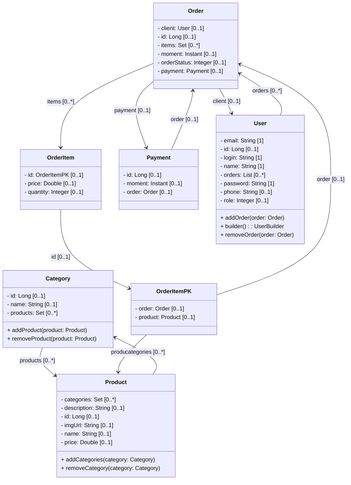
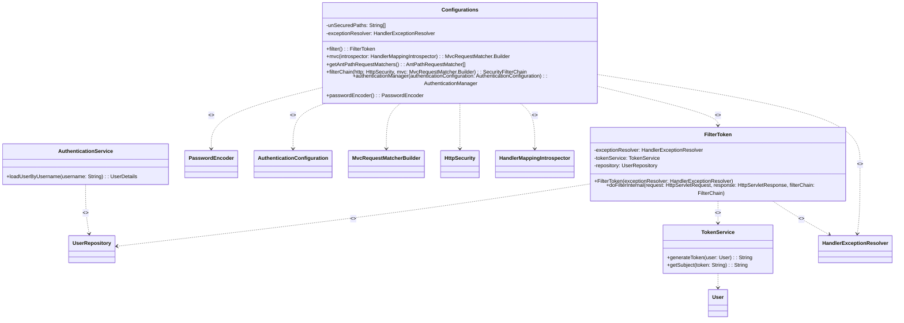
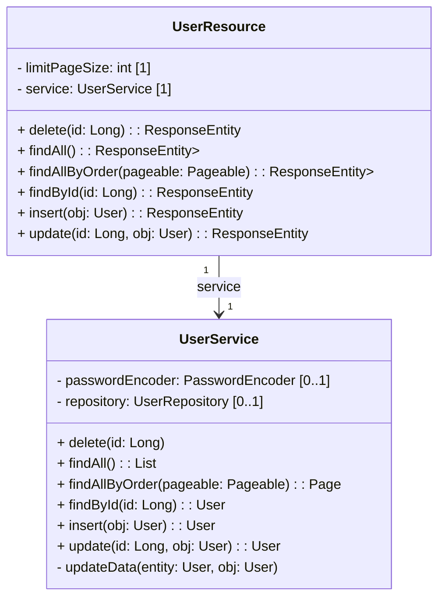
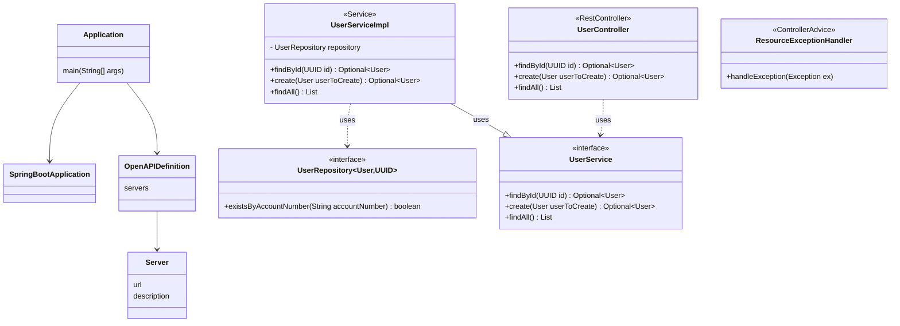
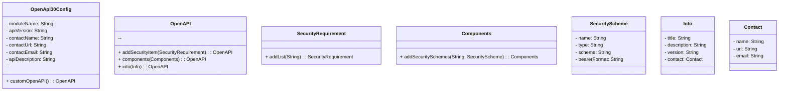

<h1 align="center">RESTFul API Orders com Spring Boot e Spring Security</h1>

## :memo: Resumo do projeto
Projeto de uma simples API de Orders para fins de prática aplicando boas práticas e autenticação/autorização via token. A base desse projeto foi baseado no curso Java do super mestre Nélio Alves, fiz diversas implementações para fins de prática e estudos.

## :classical_building: Diagrama de Classes

Obs: _Criei a representação parcial do diagrama para fins de estudos_


<br>
<details>
<summary>** Mais alguns digramas de classe: </summary>








</details>

## :rocket: Funcionalidades que implementei como forma de estudo e prática de Spring Framework
- Usei Spring Data JPA para o relacionamento entre as entidades e CRUD
- Validação dos campos;
- Validação da complexidade da senha por meio de anotação personalizada;
- Endpoint para exibir todos os cadastros de usuários usando page/size/sort/limit retornando DTO
- JWT - Autenticação e Autorização
- HandlerExceptionResolver para capturar e personalizar as exceções do Spring Security
- Configurei o Springdoc/Swagger para suporte a autenticação via token

## :wrench: Tecnologias utilizadas

* Spring Boot 3
* Spring Data JPA
* SpringDoc OpenAPI WebMVC UI
* Lombok
* Maven
* Spring Boot Start Validation
* PostgreSQL
* Java 17
* Spring Security 6
* JWT auth0 4.4

## :clipboard: Executando o projeto


- Para executar o projeto faça o clone do repositório, no diretório onde executar esse comando será criado uma pasta com o nome spring-vendas

  ```bash
  git clone https://github.com/EdsonSFreitas/orders.git
  ```

- Credenciais do banco: Se usar o profile test não precisar alterar nada por que já está configurado e usará o banco H2. 
- Se for usar ambiente DEV pode alterar diretamente o arquivo application-dev.propoerties e definir os dados de conexão
- Se for usar o ambiente de PROD, o projeto foi configurado para que o usuário e a senha de acesso ao banco estejam registradas apenas como variáveis de ambiente, portanto, crie as variáveis de ambiente de nome "DB_USER" e "DB_PASS" no Sistema Operacional ou direto na IDE de sua escolha. Por exemplo, usando Linux basta executar esses dois comandos no terminal informando o usuario e senha do seu banco relacional entre aspas duplas como no exemplo abaixo.

    ```bash
    # Substituia o conteudo entre < > pelos valores que pretende usar:
    export DATABASE_URL="jdbc:postgresql://localhost:5432/<nome do banco>"
    export PG_USERNAME="<digite aqui o usuario do seu banco>"
    export PG_PASSWORD="digite aqui a senha do seu banco"
    ```

- Precisamos também definir um hash base64 para a variável JWT_SECRET ou se não informar será usado o do projeto.
- Esse hash pode ser gerado em diversos sites ou direto no shell Linux. Use o comando echo com uma frase qualquer encadeado com o openssl para gerar o hash, repare que existe propositalmente um espaço em branco antes do comando echo, isso é uma boa prática para que o comando não fique gravado no history do shell.

    ```bash
     echo -n 'olá, sejam bem vindo ao meu projeto API Orders' | openssl base64
    ```

-  Se usou a frase acima o resultado será sempre esse hash:

    ```bash
    b2zDoSwgc2VqYW0gYmVtIHZpbmRvIGFvIG1ldSBwcm9qZXRvIEFQSSBPcmRlcnM=
    ```

- Defina o hash como valor para a variável que pretende usar, nesse exemplo usei a JWT_SECRET

    ```bash
    export JWT_SECRET="b2zDoSwgc2VqYW0gYmVtIHZpbmRvIGFvIG1ldSBwcm9qZXRvIEFQSSBPcmRlcnM="
    ```

- Compilação: Entre no diretório que contém o arquivo pom.xml e gere o artefato .jar com o comando mvn do maven:

    ```bash
    cd orders/orders
    mvn clean package -DskipTests
    ```

- Execução: Ao término do comando será gerado o arquivo vendas-0.9.8-SNAPSHOT.jar dentro da pasta target. Na mesma sessão do shell Linux que usou para definir as variáveis de ambiente execute o comando para entrar no diretório target e execute a aplicação com o comando:

    ```bash
    cd target/
    java -jar orders-0.9.8-SNAPSHOT.jar
    ```

  - Também é possível usar o comando:
    ```bash
    mvn spring-boot:run
    ```

- Com isso você terá acesso ao http://localhost:8080/swagger-ui/index.html para usar todos os endpoints disponíveis.
- No endpoint /login você pode usar o login **user** com senha **123@UmaSenha**
- Após o acesso será fornecido o token e usando-o poderá criar novos usuários com senha contendo caracteres minúsculo, maiúsculo, número e ao menos um caractere especial.
- Use token gerado na etapa anterior para autorizar o acesso via ícone de cadeado com nome “Authorize” disponível no canto direito superior para que o mesmo token seja usado em todos os endpoints.

## :soon: Implementação futura
- Revogar tokens
- Bloquear usuarios

## :dart: Status do projeto

* Em andamento

## :framed_picture: Screnshoot

